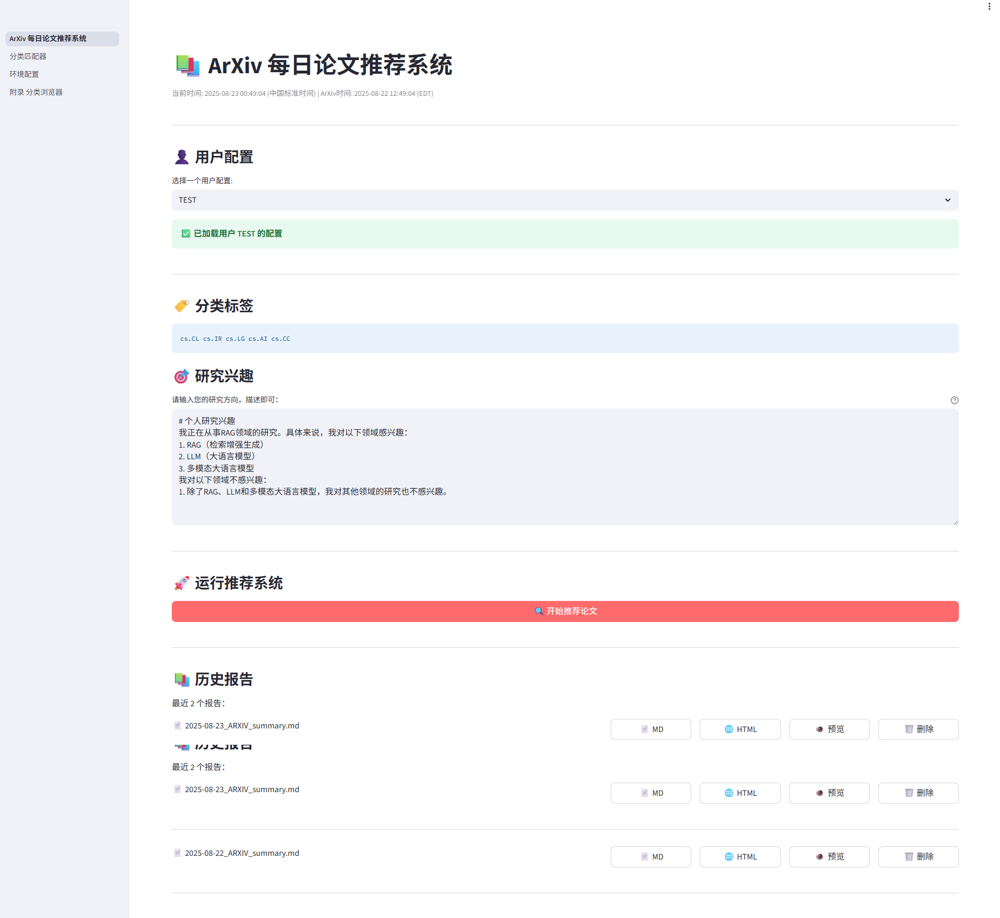
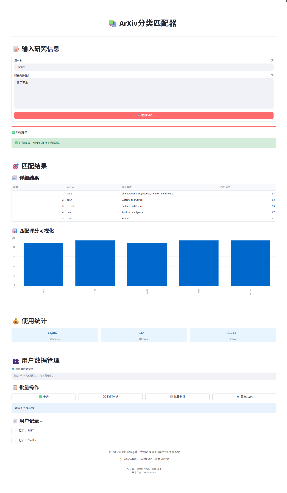
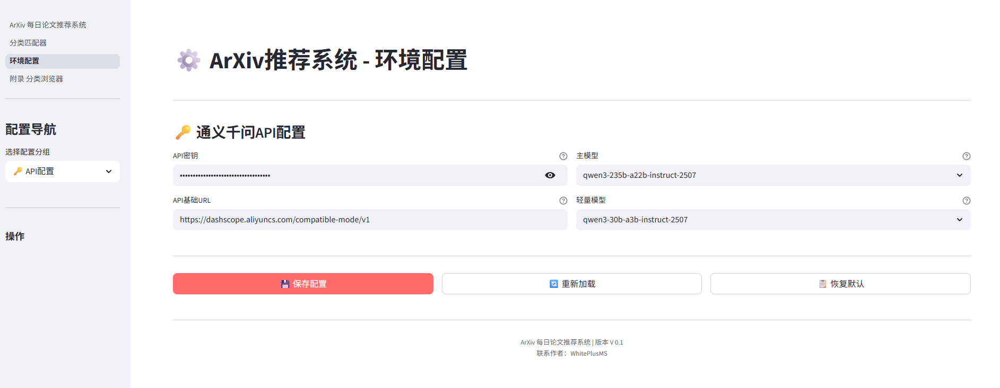

<h1 align="center">arXiv Daily Article Summary</h1>

<p align="center">
  
  
</p>

<p align="center">
  一个智能的 arXiv 论文总结工具，每日自动为您筛选、总结和推荐符合您研究兴趣的最新论文。
</p>

---

## 📚 目录导航

- [核心价值](#-核心价值) - 了解项目解决的核心问题
- [快速开始](#-快速开始) - 3 步快速体验
- [核心功能](#-核心功能) - 详细功能介绍
- [详细配置指南](#-详细配置指南) - 完整配置说明
- [使用方法](#️-使用方法) - 操作指南和架构说明
- [贡献与支持](#-贡献与支持) - 如何参与项目

---

## 🎯 核心价值

**解决科研人员的信息过载问题**

- **问题本质**：每天数千篇新论文发布，人工筛选效率极低
- **解决方案**：AI 驱动的个性化论文推荐和智能摘要
- **核心优势**：从信息噪音中精准提取有价值的研究内容

## ⚡ 快速开始

```bash
# 1. 克隆项目到本地
git clone https://github.com/WhitePlusMS/arXiv-Daily-Summary.git

# 2. 进入项目目录
cd arXiv-Daily-Summary

# 3. 推荐使用 uv 安装依赖 (如果尚未安装)
pip install uv

# 4. 使用 uv 创建虚拟环境
uv venv

# 5. 激活虚拟环境 (Windows)
.venv\Scripts\activate

# 6. 使用 uv 安装项目依赖（在uv环境启动状态下）
pip install -r requirements.txt

# 7. 复制环境变量配置文件
copy .env.example .env

# 8. 编辑 .env 文件，填入您的 API 密钥 (重要！)
#    请手动打开 .env 文件并填入 DASHSCOPE_API_KEY
#    您可以从通义千问获取 API 密钥：https://console.aliyun.com/dashscope

# 9. 启动应用程序！
python start.py

# 10. 访问 Web 界面
#    打开浏览器，访问 http://localhost:8501
#    您可以在界面中配置研究兴趣、调整参数，查看实时推荐结果

# enjoy it!
```

系统会自动处理环境配置、依赖安装和服务启动。

## ✨ 核心功能

### 智能推荐引擎

- **个性化匹配**：基于您的研究兴趣和关键词进行精准论文筛选
- **AI 深度分析**：通义千问模型驱动的论文摘要和核心观点提取
- **多维度评估**：从相关性、创新性、实用性等角度综合评分

### 自动化工作流

- **一键启动**：`python start.py` 即可完成所有配置和启动
- **智能环境管理**：自动检测和配置 Python 环境、依赖包
- **Web 界面**：Streamlit 驱动的直观操作界面

### 多样化输出

- **实时推荐**：Web 界面实时查看推荐结果
- **历史存档**：自动保存每日推荐记录到 `arxiv_history` 目录
- **格式丰富**：支持 Markdown、HTML 等多种输出格式

## 🚀 详细配置指南

### 系统要求

- **Python**: 3.10+ (推荐使用 PyEnv + uv 管理版本)
- **操作系统**: Windows/macOS/Linux
- **网络**: 需要访问 arXiv API 和通义千问 API

### 环境配置

**自动配置（推荐）**

```bash
python start.py
```

系统会自动检测并配置所需环境，包括：

- Python 版本检查
- 虚拟环境创建/激活
- 依赖包安装
- 服务启动

**手动配置**

```bash
# 1. 创建虚拟环境
python -m venv venv

# 2. 激活虚拟环境
# Windows
venv\Scripts\activate
# macOS/Linux
source venv/bin/activate

# 3. 安装依赖
pip install -r requirements.txt
```

### API 配置

**必需配置**：复制并编辑环境变量文件

```bash
cp .env.example .env
```

**关键配置项**：

```bash
# 通义千问 API（必需）
DASHSCOPE_API_KEY=your_dashscope_api_key

# arXiv 配置
ARXIV_CATEGORIES=cs.CV,cs.LG,cs.AI  # 关注的论文分类
MAX_ENTRIES=5                       # 每个分类获取论文数
NUM_PAPERS=5                        # 推荐论文总数
```

### 个性化设置

在 Web 界面中配置您的研究兴趣：

1. 启动系统后访问 Web 界面
2. 进入"分类匹配器"页面
3. 选择感兴趣的 arXiv 分类
4. 系统会自动保存您的偏好

## 🏃‍♂️ 使用方法

### Web 界面操作

**启动系统**

```bash
python start.py
```

**功能页面**

- **主页**：论文推荐和摘要生成
- **分类匹配器**：配置个人的研究兴趣和论文分类
- **环境配置**：查看和调整系统配置
- **分类浏览器**：浏览所有可用的 arXiv 分类

### 界面预览

**主界面 - 论文推荐和摘要生成**



**分类匹配界面 - 配置研究兴趣**



**环境配置界面 - 系统设置**



**附录界面 - 分类浏览器**


### 工作流程

1. **论文获取**：从 arXiv API 获取指定分类的最新论文
2. **智能筛选**：基于用户兴趣进行相关性匹配
3. **AI 分析**：使用通义千问模型生成论文摘要和评分
4. **结果展示**：在 Web 界面展示推荐结果
5. **历史存档**：自动保存推荐记录到本地文件

## 🤝 贡献与支持

**贡献代码**

```bash
# 1. Fork 本项目
在 GitHub 页面点击 "Fork" 按钮复制项目到您的账号

# 2. 克隆到本地
git clone https://github.com/YOUR_USERNAME/arXiv-Daily-Summary.git
cd arXiv-Daily-Summary

# 3. 创建功能分支
git checkout -b feature/your-feature

# 4. 开发并提交更改
git add .
git commit -m "feat: 添加新功能描述"

# 5. 推送到远程
git push origin feature/your-feature

# 6. 创建 Pull Request
在 GitHub 页面创建 PR，详细描述您的改动
```

**问题反馈**

- 发现 Bug？请提交 [Issue](https://github.com/your-repo/issues)
- 有新想法？欢迎讨论和建议
- 觉得有用？请给项目点个 Star

## 📄 许可证

本项目采用 [Apache 2.0 许可证](LICENSE)

## 🙏 致谢

- 感谢 [arxiv Python包](https://pypi.org/project/arxiv/) 的作者，它提供了非常便捷的论文下载功能。
- 本项目的灵感来源于以下优秀的开源项目，感谢它们的作者：
  - [TideDra/zotero-arxiv-daily](https://github.com/TideDra/zotero-arxiv-daily)
  - [Vincentqyw/cv-arxiv-daily](https://github.com/Vincentqyw/cv-arxiv-daily)
  - [AutoLLM/ArxivDigest](https://github.com/AutoLLM/ArxivDigest)

---

<p align="center">
  <strong>让 AI 帮您从信息海洋中发现真正有价值的研究</strong>
</p>
