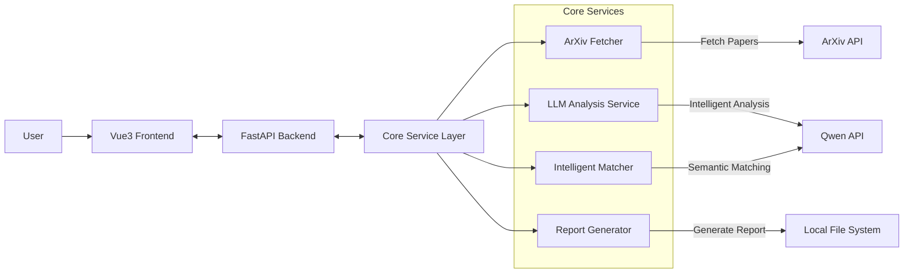

<div align="center">
  
  <h1>arXiv Daily Article Summary</h1>
  <p>
    
    
    
    
    <a href="https://deepwiki.com/WhitePlusMS/arXiv-Daily-Summary"></a>
  </p>
  <p>
    <a href="./README.md">中文</a> | <a href="./README_EN.md">English</a>
  </p>
</div>

> 🎯 **Project Introduction**
>
> **An intelligent arXiv paper summary tool that automatically filters, summarizes, and recommends the latest papers tailored to your research interests daily.**
>
> **Core Highlights:**
> *   **Personalized Matching**: Precise paper filtering based on your research interests and keywords.
> *   **AI Deep Analysis**: Paper abstracts and core insights extraction powered by the Qwen model.
> *   **Multi-dimensional Evaluation**: Comprehensive scoring based on relevance, innovation, and practicality.
> *   **All-platform Support**: Modern Web interface + Daily email delivery.

---

## 📚 Table of Contents

- [💻 Interface Preview](#-interface-preview) - View system screenshots
- [🏗️ System Architecture](#️-system-architecture) - Understand technical architecture
- [✨ Core Features](#-core-features) - Understand core problems solved
- [⚡ Quick Start](#-quick-start) - One-click start, quick experience
- [⚙️ Usage Guide](#️-usage-guide) - Detailed operation guide
- [🔧 Troubleshooting](#-troubleshooting) - Common issues and solutions
- [🤝 Contribution & Support](#-contribution--support) - How to participate

---

## 💻 Interface Preview

|       **Main Interface - Paper Recommendation & Summary**       |               **Category Matcher - Configure Interests**                |
| :-------------------------------------------------------------: | :---------------------------------------------------------------------: |
|  |  |

|                 **Environment Config - System Settings**                  |               **Appendix Interface - Category Browser**               |
| :-----------------------------------------------------------------------: | :-------------------------------------------------------------------: |
|  |  |

**Report Generation Effect:**

|                                                                              **Markdown Report**                                                                              |                                                                          **HTML Online Report**                                                                           |
| :---------------------------------------------------------------------------------------------------------------------------------------------------------------------------: | :-----------------------------------------------------------------------------------------------------------------------------------------------------------------------: |
| <a href="./arxiv_history/2025-08-23_ARXIV_summary.md"></a> | <a href="./arxiv_history/2025-08-23_ARXIV_summary.html"></a> |

---

## 🏗️ System Architecture

### 🛠️ Tech Stack

| Module         | Technology Stack              | Description                                      |
| :------------- | :---------------------------- | :----------------------------------------------- |
| **Backend**    | **FastAPI** + Python 3.10+    | High-performance asynchronous API service        |
| **Frontend**   | **Vue 3** + TypeScript + Vite | Modern reactive Web interface                    |
| **AI Model**   | **Qwen** (DashScope API)      | Powerful long-text understanding & summarization |
| **Storage**    | JSON Files + Local FS         | Lightweight local storage, no DB config needed   |
| **Deployment** | Docker / Local                | Supports local dev and production deployment     |

### 📐 Architecture Design



```
┌─────────────────┐    ┌─────────────────┐    ┌─────────────────┐
│  Vue3 Frontend  │    │ FastAPI Backend │    │  Core Services  │
│                 │    │                 │    │                 │
│ • User Interface│◄──►│ • RESTful API   │◄──►│ • Paper Fetching│
│ • State Mgmt    │    │ • Data Valid    │    │ • Intel Matching│
│ • Route Mgmt    │    │ • Business Logic│    │ • AI Analysis   │
│ • Components    │    │ • Async Process │    │ • Report Gen    │
└─────────────────┘    └─────────────────┘    └─────────────────┘
```

### 📂 Module Organization

- **`fastapi_services/`**: FastAPI Backend Services
  - `fastapi_app.py`: Main app entry and API routes
  - `models.py`: Data model definitions
  - `service_container.py`: Dependency injection container
  - Various business service modules

- **`web/`**: Vue3 Frontend Application
  - Built with Vite
  - TypeScript support
  - Component-based development

- **`core/`**: Core Business Logic
  - `arxiv_fetcher.py`: ArXiv paper fetcher
  - `recommendation_engine.py`: Recommendation engine (filter, score, analyze)
  - `category_matcher.py`: Category matcher (interests to ArXiv categories)
  - `llm_provider.py`: LLM provider (supports Qwen, OpenAI compatible interfaces)
  - `pdf_text_extractor.py`: PDF text extractor
  - `prompt_manager.py`: Prompt manager (unified AI prompt templates)
  - `output_manager.py`: Output manager (report generation, email sending)
  - `email_sender.py`: Email sender (supports SMTP/SSL/TLS)
  - `template_renderer.py`: Template renderer (Jinja2 engine)

- **`config/`**: Configuration Directory
  - `prompts.default.json`: Default prompt templates
  - `prompts.json`: User custom prompts (overrides defaults)
  - `arxiv_categories.json`: ArXiv category definitions
  - `templates/`: Jinja2 report templates

---

## ✨ Core Features

### 🧠 Intelligent Recommendation Engine

- **Personalized Matching**: Precise paper filtering based on your research interests and keywords.
- **AI Deep Analysis**: Paper abstracts and core insights extraction powered by the Qwen model.
- **Multi-dimensional Evaluation**: Comprehensive scoring based on relevance, innovation, and practicality.

### 🎨 Modern Web Interface

- **Responsive Design**: Modern UI based on Vue3.
- **Real-time Interaction**: High-performance API support via FastAPI.
- **Component-based**: Reusable UI components and clear code structure.

### 📤 Diverse Outputs

- **Real-time Recommendation**: View results instantly on the Web interface.
- **History Archive**: Automatically save daily records to `arxiv_history` directory.
- **Rich Formats**: Supports Markdown, HTML, and other output formats.

### 📝 Intelligent Prompt Management

- **Template Design**: All AI prompts use template design, supporting variable substitution.
- **Flexible Customization**: Customize prompts in Web UI or config files to override defaults.
- **Version Management**: Separate management for default and user prompts, supports one-click reset.

### 🤖 Dual Model Strategy

- **Heavy Model**: For detailed analysis and deep understanding, e.g., `qwen-plus`.
- **Light Model**: For rapid screening and preliminary evaluation, e.g., `qwen-turbo`.
- **Smart Scheduling**: Automatically selects the appropriate model based on task complexity to balance speed and quality.

### 📊 Progress Tracking & Real-time Feedback

- **Task Progress**: Real-time tracking for long-running tasks.
- **WebSocket Support**: Frontend can get real-time backend task status.
- **Detailed Logs**: Complete run logs for easy troubleshooting.

---

## ⚡ Quick Start

### Requirements

- **Python**: 3.10 or higher
- **Node.js**: 20.19.0 or higher
- **Package Managers**: Recommended to use uv (Python) and npm (Node.js)

### 🚀 One-click Start (Recommended)

```bash
# 1. Clone project locally
git clone https://github.com/WhitePlusMS/arXiv-Daily-Summary.git

# 2. Enter project directory
cd arXiv-Daily-Summary

# 3. Recommend using uv to install dependencies (if not installed)
pip install uv

# 4. Create virtual environment with uv
uv venv

# 5. Activate virtual environment (Windows)
.venv\Scripts\activate

# 6. Install project dependencies with uv (while venv is active)
pip install -r requirements.txt

# 7. Copy environment configuration file
copy .env.example .env

# 8. Edit .env file, fill in your API Key (Important!)
#    Please manually open .env file and fill in DASHSCOPE_API_KEY
#    You can get API Key from DashScope: https://console.aliyun.com/dashscope

# 9. Start FastAPI + Vue3 Application!
python start_fastapi.py

# 10. Access Application
#    Frontend: http://localhost:5173
#    Backend API: http://localhost:8000
#    API Docs: http://localhost:8000/docs

# enjoy it!
```

### 🐳 Docker Deployment (Recommended for Production)

Use Docker Compose to quickly deploy the entire system without manual environment configuration:

```bash
# 1. Clone project locally
git clone https://github.com/WhitePlusMS/arXiv-Daily-Summary.git
cd arXiv-Daily-Summary

# 2. Enter docker directory
cd docker

# 3. Start services (First time will pull images from Docker Hub)
docker compose up -d

# 4. Check service status
docker compose ps

# 5. Access Application
#    Frontend: http://localhost:5173
#    Backend API: http://localhost:8000
#    API Docs: http://localhost:8000/docs
```

**Configure API Key:**

1. After first start, the system automatically creates `.env` from `.env.example`.
2. Access Frontend: http://localhost:5173
3. Click "Environment Config" in the left sidebar.
4. In "🤖 Model & API Config" group, fill in your `DASHSCOPE_API_KEY`.
5. Click "💾 Save Config" button.

**Stop Services:**

```bash
# Stop services
docker compose down

# Stop services and remove volumes (Use with caution)
docker compose down -v
```

**Data Persistence:**

All data (including `.env` config, history, user data, logs) are saved in Docker Volumes, so data is safe even if containers are removed.

**Notes:**

- First start pulls images from Docker Hub, which may take a few minutes.
- Default ports: Frontend 5173, Backend 8000.
- Ensure configured ports are not in use.
- If ports are modified, access addresses change accordingly (e.g., http://localhost:8080).

---

## ⚙️ Usage Guide

### 1. 👤 User Creation

The core of "User Creation" is establishing a precise ArXiv category profile for each user via the **Category Matcher** interface. It allows users to describe their research interests in natural language, and the system automatically matches them with official ArXiv categories.

**Operation Flow:**

1. **Access Category Matcher**: Click "Category Matcher" in the left sidebar.
2. **Input Information**:
    - **Username**: Enter a unique username to identify and save your matches.
    - **Research Description**: Detail your research direction, interests, keywords, etc. Example:

        ```
        I focus on Retrieval-Augmented Generation (RAG) using Large Language Models (LLM), especially optimizing performance on multi-modal data.
        ```

3. **Start Matching**: Click "Start Matching" button.
4. **Auto Match & Save**:
    - The backend calls the LLM to semantically compare your description with official ArXiv categories defined in `config/arxiv_categories.json`.
    - Returns a list of categories sorted by match score.
    - Top-scoring categories are automatically saved to `data/users/user_categories.json` associated with your username.

**Data Management:**

The bottom of the page offers full management of created user data:
- **View & Search**: Browse all user records, search by username or content.
- **Edit**: Modify user research descriptions and re-match.
- **Delete**: Delete single or batch user records.
- **Export**: Export user data as JSON.

### 2. 📰 Daily Paper Recommendation

After creating a user profile, the **ArXiv Daily Paper Recommendation System** on the main interface provides the core recommendation function. It automatically fetches, filters, and analyzes the latest relevant papers based on the selected user profile.

**Operation Flow:**

1. **Select User Config**: In the top dropdown, select a user created in "Category Matcher".
    - System loads the user's config, including **Category Tags** and **Research Interests**.
2. **Adjust Parameters** (Optional):
    - **Max Papers**: Max papers to fetch per category.
    - **Detail Analysis**: Number of papers for detailed analysis.
    - **Brief Analysis**: Number of papers for brief analysis.
    - **Relevance Threshold**: Minimum relevance score (0-100).
3. **Start Recommendation**: Click "Start Recommendation" button.
4. **Monitor & View Results**:
    - **Real-time Logs** appear below, showing steps like "Fetching Papers", "Analyzing Papers", "Generating Report".
    - Upon success, results are shown in tabs: **Abstracts**, **Detailed Analysis**, **Brief Analysis**.
    - Complete `HTML` and `Markdown` reports are generated for preview or download.
    - Reports are saved to `arxiv_history` directory, named `YYYY-MM-DD_Username_ARXIV_summary.{html|md}`.

### 3. 🛠️ Environment Configuration

The **Environment Configuration Interface** provides centralized management of system parameters:

**Model & API Config:**
- Main and Light model selection.
- API Key and Base URL configuration.
- Model parameter tuning (Temperature, top_p, max tokens).

**ArXiv Config:**
- ArXiv API Base URL and retry strategy.
- Paper fetch limits.
- Relevance filter thresholds.

**Email Config:**
- Enable/Disable email sending.
- SMTP server config (SSL/TLS supported).
- Sender and Receiver settings.

**Timezone & Log Config:**
- Timezone setting (affects report time).
- Log level and file management.

**Operation Instructions:**
1. Click "Environment Config" in left sidebar.
2. Select the config group to modify.
3. Modify values and click "Save Changes".
4. Supports group reset and global reset.

### 4. ✍️ Prompt Management

The system supports custom AI prompt templates to adjust analysis style and depth.

**Prompt Types:**
- **Category Match Prompt**: Matches user interests to ArXiv categories.
- **Relevance Eval Prompt**: Evaluates paper relevance to user interests.
- **Detail Analysis Prompt**: Generates detailed paper analysis reports.
- **Brief Analysis Prompt**: Generates brief paper analysis reports.

**Operation Instructions:**
1. Find "Prompt Management" in "Environment Config".
2. Select prompt template to modify.
3. Edit content (supports variable placeholders like `{description}`, `{paper_title}`).
4. Click "Save" to apply.
5. "Reset to Default" supported.

**Prompt Variables:**
- `{description}`: User research interest description
- `{paper_title}`: Paper title
- `{paper_abstract}`: Paper abstract
- `{paper_authors}`: Paper authors
- `{paper_categories}`: Paper categories
- See prompt template comments for more.

---

## 🔧 Troubleshooting

### Common Issues

**1. Start Failed: Virtual Environment Not Activated**

```
Error: VIRTUAL_ENV environment variable not set!
Solution: Please activate virtual environment first
Windows: .venv\Scripts\activate
Linux/Mac: source .venv/bin/activate
```

**2. API Call Failed: 401 or 403 Error**

```
Error: API Authentication Failed
Solution:
1. Check if DASHSCOPE_API_KEY in .env is correct
2. Confirm API Key is valid and not expired
3. Check if account has sufficient balance
```

**3. Frontend Cannot Connect to Backend**

```
Error: CORS Error or Connection Failed
Solution:
1. Confirm backend service is running (http://localhost:8000)
2. Check if frontend port matches backend CORS config
3. Check browser console for errors
```

**4. Paper Fetch Failed: Network Timeout**

```
Error: ArXiv API Request Timeout
Solution:
1. Check network connection
2. Increase ARXIV_RETRIES in config
3. Increase ARXIV_DELAY (request interval)
```

**5. Prompt Template Error**

```
Error: Template variable missing or format error
Solution:
1. Check if variable names in prompt are correct
2. Confirm placeholder format is {variable_name}
3. Check logs for detailed error info
4. Try resetting to default prompts
```

### View Logs

System logs are saved in `logs/` directory:

```bash
# View latest logs
tail -f logs/fastapi.log

# View error logs
grep ERROR logs/fastapi.log
```

---

## 🤝 Contribution & Support

**Contribute Code**

```bash
# 1. Fork Project
Click "Fork" button on GitHub page

# 2. Clone locally
git clone https://github.com/YOUR_USERNAME/arXiv-Daily-Summary.git
cd arXiv-Daily-Summary

# 3. Create Feature Branch
git checkout -b feature/your-feature

# 4. Commit Changes
git add .
git commit -m "feat: Add new feature description"

# 5. Push to Remote
git push origin feature/your-feature

# 6. Create Pull Request
Create PR on GitHub, describing your changes
```

**Feedback**

- Found a Bug? Submit an [Issue](https://github.com/your-repo/issues)
- Have an idea? Discussions and suggestions welcome
- Find it useful? Please Star the project

## 📄 License

This project is licensed under the [Apache 2.0 License](LICENSE)

## 🙏 Acknowledgements

- Thanks to the author of [arxiv Python package](https://pypi.org/project/arxiv/) for convenient paper downloading.
- Inspired by these excellent open source projects:
  - [TideDra/zotero-arxiv-daily](https://github.com/TideDra/zotero-arxiv-daily)
  - [Vincentqyw/cv-arxiv-daily](https://github.com/Vincentqyw/cv-arxiv-daily)
  - [AutoLLM/ArxivDigest](https://github.com/AutoLLM/ArxivDigest)

---

<p align="center">
  <strong>Let AI help you discover truly valuable research from the ocean of information</strong>
</p>
